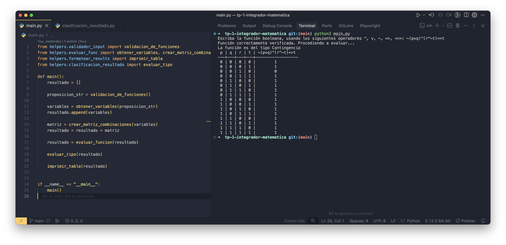

# Clasificador de Proposiciones Compuestas

Permitan al usuario ingresar una proposición compuesta (por ejemplo, p∨¬p, p∧¬p o p⇒q).
El programa debe generar la tabla de verdad y clasificarla como tautología, contradicción o contingencia según corresponda

## Flujo de funcionamiento del programa

1. El usuario ingresa una expresión booleana para poder obtener la tabla de verdad y el tipo de resultado.
2. Se valida la expresión para saber si hay caracteres inválidos. Si se da el caso, se lanza un error con un mensaje amigable, explicando los requerimientos a seguir para enviar la expresión booleana.
3. Después, a través de transformaciones y evaluaciones sobre la expresión dada, se genera la matriz (lista de listas) que contiene todas las combinaciones binarias con su respectivo resultado.
4. Durante las evaluaciones, se tienen en cuenta el inicio y fin de paréntesis, cuando se usan variables, cuando se usan operadores. En el caso de los operadores booleanos, se evalúa en el momento cuando se cumplen los requerimientos para usar las funciones creadas.
5. Luego de la evaluación, se analiza el resultado y se sabe si es tautología, contingencia o contradicción.
6. Para terminar, se formatea la salida de la tabla de verdad para que podamos apreciar de forma clara cómo son las combinaciones binarias y el resultado de cada una.

## Convención utilizada para las operaciones y sus funciones

- AND(a, b): ^
- OR(a, b): v
- NOT(a): ~
- IMPL(a, b): =>
- XIMPL(a, b): <=>
